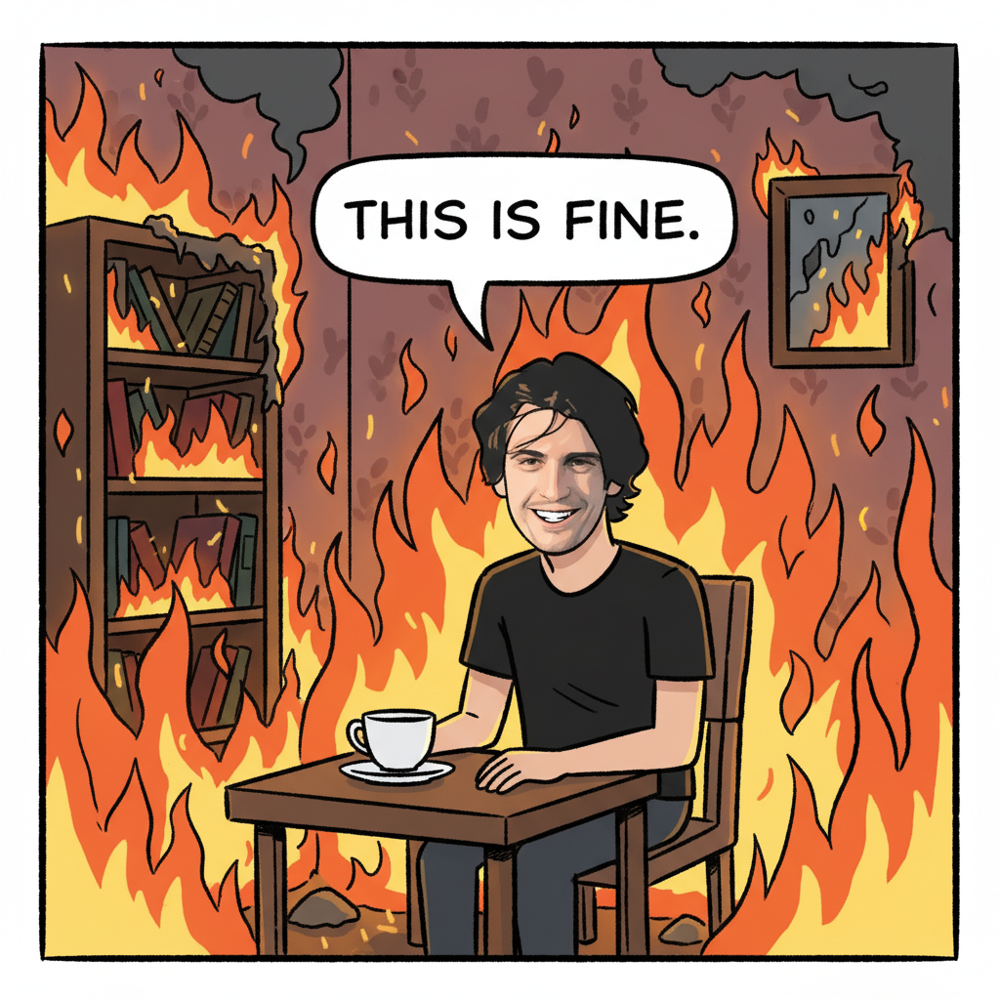

# Nano Banana Demo Apps & Examples

## 🎯 Live Demo Apps

These are **real production apps** from berrry.app that use Nano Banana:

## 🎨 Image Generation Examples

### example_01_1117.png
- **Prompt**: Create an image using the reference as inspiration
- **Dimensions**: 512x512
- **Style**: nanobanana
- **Created**: 9/6/2025
- **API Call**: `GET /api/nanobanana/image/512/512?prompt=Create%20an%20image%20using%20the%20reference%20as%20inspiration`

### example_02_1115.png
- **Prompt**: make it about Twitter
- **Dimensions**: 512x512
- **Style**: nanobanana
- **Created**: 9/6/2025
- **API Call**: `GET /api/nanobanana/image/512/512?prompt=make%20it%20about%20Twitter`

### example_03_1114.png
- **Prompt**: make this photorealistic
- **Dimensions**: 512x512
- **Style**: nanobanana
- **Created**: 9/6/2025
- **API Call**: `GET /api/nanobanana/image/512/512?prompt=make%20this%20photorealistic`

### example_04_1113.png
- **Prompt**: put me into distracted boyfriend meme instead
- **Dimensions**: 512x512
- **Style**: nanobanana
- **Created**: 9/6/2025
- **API Call**: `GET /api/nanobanana/image/512/512?prompt=put%20me%20into%20distracted%20boyfriend%20meme%20instead`

### example_05_1112.png
- **Prompt**: make me look like Gandalf
- **Dimensions**: 512x512
- **Style**: nanobanana
- **Created**: 9/6/2025
- **API Call**: `GET /api/nanobanana/image/512/512?prompt=make%20me%20look%20like%20Gandalf`

### example_06_1111.png
- **Prompt**: make me look like Han Solo
- **Dimensions**: 512x512
- **Style**: nanobanana
- **Created**: 9/6/2025
- **API Call**: `GET /api/nanobanana/image/512/512?prompt=make%20me%20look%20like%20Han%20Solo`

### example_07_1110.png
- **Prompt**: put me into the this is fine meme
- **Dimensions**: 512x512
- **Style**: nanobanana
- **Created**: 9/6/2025
- **API Call**: `GET /api/nanobanana/image/512/512?prompt=put%20me%20into%20the%20this%20is%20fine%20meme`

### example_08_1109.png
- **Prompt**: test wizard
- **Dimensions**: 512x512
- **Style**: nanobanana
- **Created**: 9/6/2025
- **API Call**: `GET /api/nanobanana/image/512/512?prompt=test%20wizard`

### example_09_1105.png
- **Prompt**: vibe coding pelican riding a bicycle in matrix
- **Dimensions**: 512x512
- **Style**: nanobanana
- **Created**: 9/6/2025
- **API Call**: `GET /api/nanobanana/image/512/512?prompt=vibe%20coding%20pelican%20riding%20a%20bicycle%20in%20matrix`

### example_10_1103.png
- **Prompt**: pelican riding a bicycle in matrix
- **Dimensions**: 512x512
- **Style**: nanobanana
- **Created**: 9/6/2025
- **API Call**: `GET /api/nanobanana/image/512/512?prompt=pelican%20riding%20a%20bicycle%20in%20matrix`

### example_11_1102.png
- **Prompt**: Magical banana wizard casting spells
- **Dimensions**: 512x512
- **Style**: nanobanana
- **Created**: 9/6/2025
- **API Call**: `GET /api/nanobanana/image/512/512?prompt=Magical%20banana%20wizard%20casting%20spells`

### example_12_1101.png
- **Prompt**: Abstract banana art in watercolor style
- **Dimensions**: 512x512
- **Style**: nanobanana
- **Created**: 9/6/2025
- **API Call**: `GET /api/nanobanana/image/512/512?prompt=Abstract%20banana%20art%20in%20watercolor%20style`

### example_13_1100.png
- **Prompt**: Banana in space suit floating among stars
- **Dimensions**: 512x512
- **Style**: nanobanana
- **Created**: 9/6/2025
- **API Call**: `GET /api/nanobanana/image/512/512?prompt=Banana%20in%20space%20suit%20floating%20among%20stars`

## 📊 Most Popular Prompts

## 🚀 Quick Start

To see these demos in action:

1. Visit any of the live URLs above
2. View source to see how nanobanana API is used
3. Check the app files in `apps/[subdomain]/` directories
4. Run the apps locally using berrry.app infrastructure

## 💡 Integration Patterns

From analyzing the demo apps, common patterns include:

- **Hero Images**: ``
- **Dynamic Content**: JavaScript generating URLs based on user input
- **CSS Backgrounds**: `background-image: url('/api/nanobanana/image/...')`
- **Fallback Handling**: Apps gracefully handle generation failures
